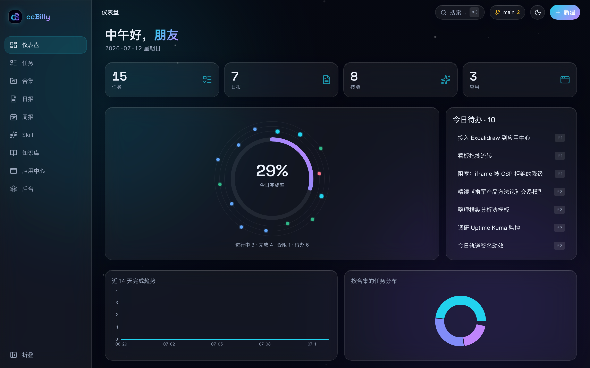
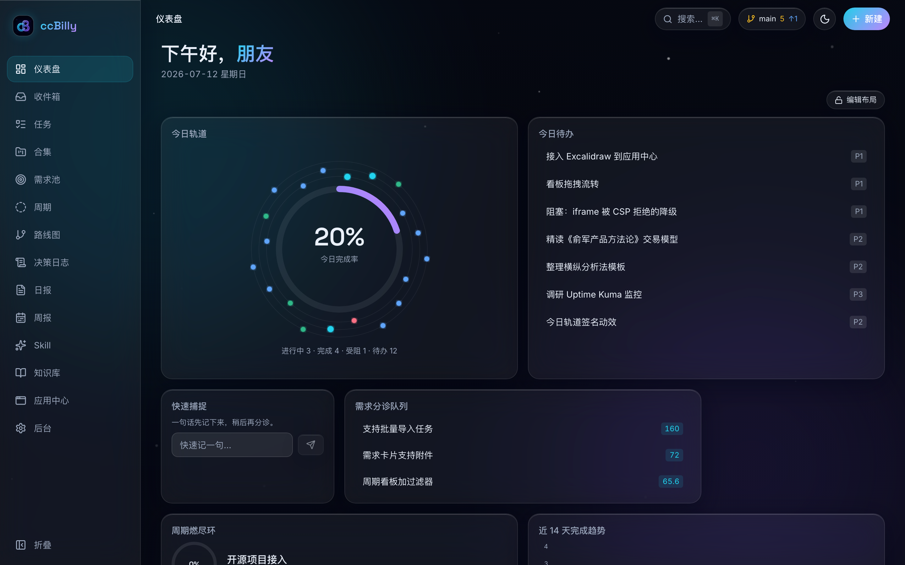
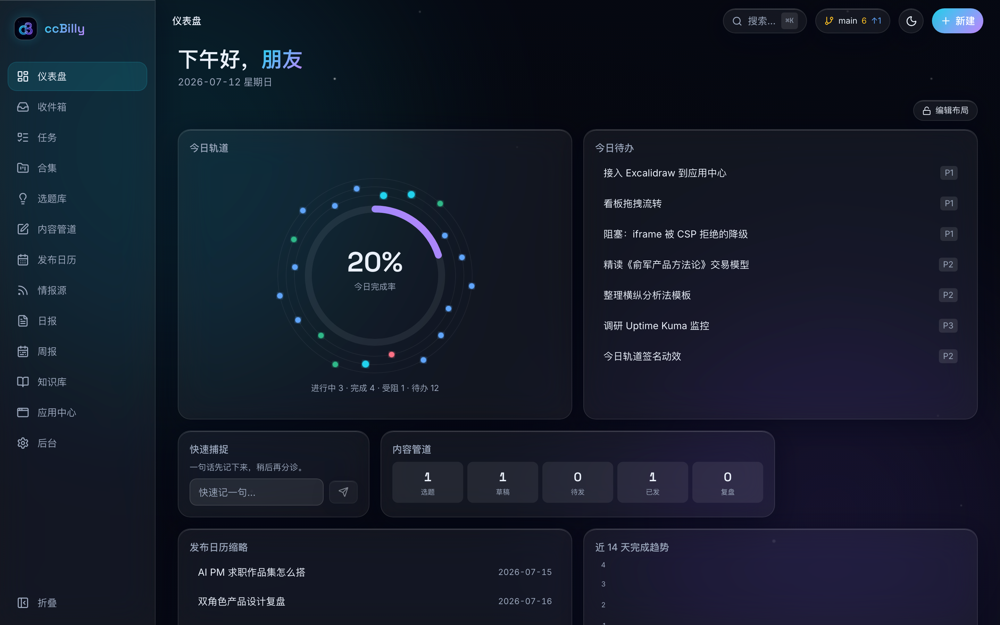
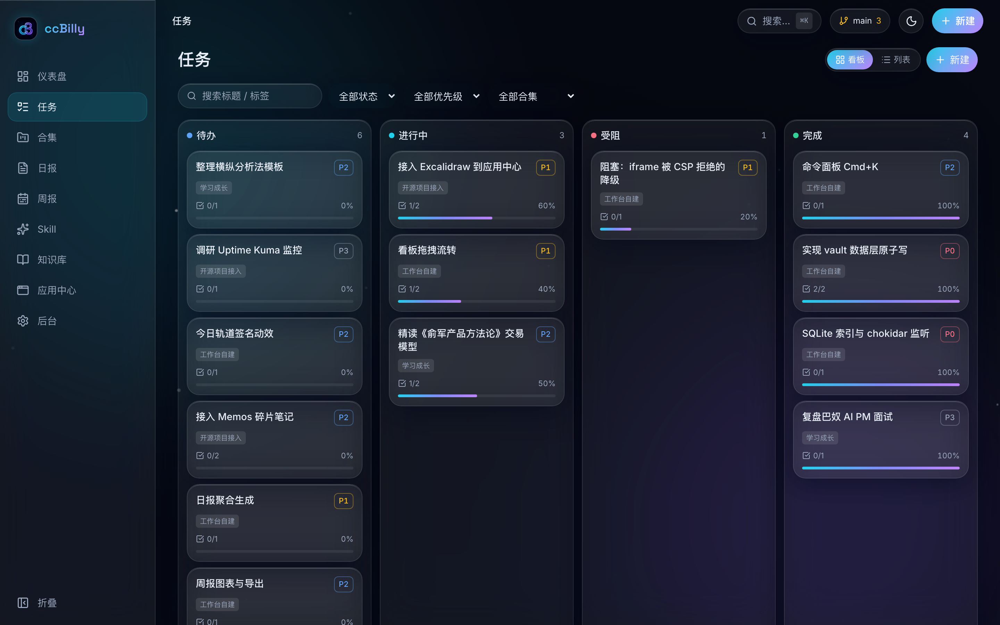
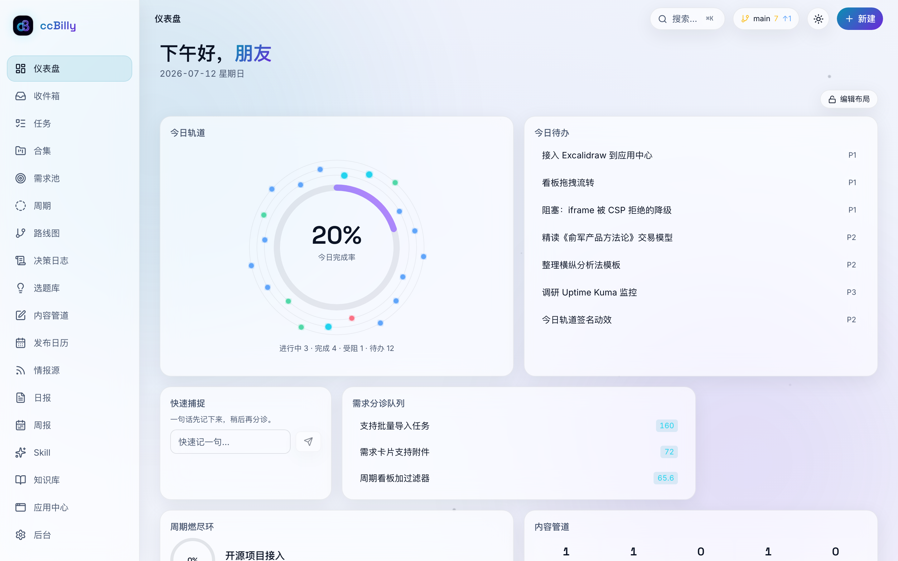

# ccBilly 工作台

> **双角色**的本地优先（local-first）个人工作台 —— 同一内核、两套人格：**产品经理（PM）** 与 **自媒体创作者**。任务/日报/周报/知识库/应用中心之外，PM 模式给你需求池·RICE·周期燃尽·路线图·决策日志，创作者模式给你选题库·内容管道·发布日历·数据复盘·情报源。深空玻璃拟态视觉，明暗双主题，可拖拽 Widget 仪表盘，还内置 **MCP server**，可供兼容客户端与 Agent 直接驱动。

[](https://github.com/ccBilly-aipm/ccbilly-worker/actions/workflows/ci.yml)     

一个把「任务/需求/内容 → 自动生成日报/周报/复盘」跑成无手工拷贝闭环的个人工作台。数据不锁进数据库，而是一堆干净的 Markdown 文件，你随时能用 Obsidian 打开、用 Git 同步、粘进飞书。首次启动选个角色（PM / 创作者 / 双修），工作台就按你的角色定制模块与仪表盘布局——切换只改展示、绝不动数据。用 Next.js 15 + TypeScript 构建，`vault/` 里附带演示数据，`pnpm install && pnpm dev` 即可开跑。

> **数据即 Markdown**：所有业务数据都是 `vault/` 目录下的纯文本 `.md` 文件（YAML frontmatter + Markdown 正文）。Git 友好、Obsidian 可直接打开、可无损粘贴进飞书。SQLite（`cache/index.db`）只是可随时重建的索引缓存，从不作为事实来源。

> **关于演示数据**：仓库自带的 `vault/` 内容全部由 `pnpm seed` 生成、仅供演示（任务/日报/技能等均为占位示例），不含任何真实个人数据。你可以直接删掉 `vault/` 里的内容从零开始，或改写成自己的。

## 界面预览

<p align="center">
  
</p>

**双角色 · 同一内核两套人格**（仪表盘按角色预设呈现不同模块与布局）：

<table>
  <tr>
    <td width="50%"><br><sub>PM 模式 · 需求分诊队列（RICE）+ 周期燃尽环</sub></td>
    <td width="50%"><br><sub>创作者模式 · 内容管道 + 发布日历</sub></td>
  </tr>
  <tr>
    <td width="50%"><br><sub>任务看板 · 拖拽改状态自动记动态</sub></td>
    <td width="50%"><br><sub>亮色主题（云海晨光）· 无 FOUC</sub></td>
  </tr>
</table>

<sub>深空玻璃拟态，明暗双主题。截图由 <code>pnpm screenshots</code> 对演示数据自动生成，界面改版可一键重生成。</sub>

---

## 快速开始

```bash
# 1. 启用 pnpm（首次）
corepack enable

# 2. 安装依赖
pnpm install

# 3.（可选）生成一套演示数据
pnpm seed

# 4. 启动开发服务器
pnpm dev            # 打开 http://localhost:3000
```

> Node 20+。首次装依赖若提示 better-sqlite3 需要编译原生模块，见下方「原生依赖」。

### 常用命令

| 命令 | 作用 |
|---|---|
| `pnpm dev` | 本地开发（http://localhost:3000） |
| `pnpm verify` | lint + typecheck + 单元测试 + 构建（提交前必须全绿） |
| `pnpm test` | 只跑单元测试（Vitest） |
| `pnpm test:e2e` | 端到端测试（Playwright / chromium） |
| `pnpm seed` | 生成演示数据到 `vault/` |
| `pnpm reindex` | 从 `vault/` 重建 SQLite 索引缓存 |

---

## GitHub 多设备同步工作流

1. 把整个项目（**含 `vault/`**）推到 GitHub。`vault/` 是数据载体，必须提交；`cache/`、`node_modules/`、`.next/`、`.env*` 已在 `.gitignore` 中排除。
2. 换设备后：`git pull` → `pnpm install` → `pnpm dev`，全部数据即刻恢复。
3. 日常同步用后台的 **Git 面板**（M5 上线）：一键「快速提交」+「同步（pull --rebase 后 push）」。检测到冲突时会列出冲突文件，请用 Obsidian / 编辑器手动解决——**本工具永不 force push**。

## 配合 Obsidian

- 把 `vault/` 作为一个 Obsidian 库打开（或软链进你现有库）。双向编辑互不冲突：你在 Obsidian 里改任一文件，工作台会在**数秒内自动感知并刷新**（chokidar 监听）。
- 支持 `[[wiki 双链]]`。`vault/.obsidian/` 默认被 gitignore；若你想同步 Obsidian 工作区配置，删掉 `.gitignore` 里对应那行即可。

## 配合飞书

- 日报 / 周报页面的「**复制为 Markdown**」按钮输出纯 Markdown（无 HTML），粘贴进飞书文档标题、列表、链接格式不乱（M3 上线）。

---

## 原生依赖（better-sqlite3）

better-sqlite3 是原生模块，需要在本机编译一次。pnpm 默认会拦截构建脚本，本仓库已在 `pnpm-workspace.yaml` 用 `onlyBuiltDependencies` 放行。若首次安装后 `cache/index.db` 无法创建，手动重建原生二进制：

```bash
pnpm rebuild better-sqlite3
```

## 安全模型与三种部署姿势

工作台按「本机默认零配置、暴露场景强制安全」设计，用 `AUTH_MODE` 环境变量分层（详见 [SECURITY.md](SECURITY.md) 与 [docs/SECURITY_AUDIT.md](docs/SECURITY_AUDIT.md)）：

### 1）本机单人（默认）— `AUTH_MODE=none`

```bash
pnpm dev            # localhost:3000，所有写操作免登录，体验最顺
```

只在本机 `localhost` 使用时无需任何配置。**只要别把端口暴露到局域网/公网即可。** 若真有非本机地址访问进来而你没启用鉴权，写操作会被 **fail-closed 拒绝**并提示配置（不会裸奔）。

### 2）局域网 / 公网 — `AUTH_MODE=passcode`

对外暴露时**必须**启用口令鉴权。复制 `.env.example` 为 `.env.local`：

```
AUTH_MODE=passcode
ADMIN_PASSCODE=一个强口令
```

此时**所有写操作**（不只 `/admin`）都需要先登录后台会话。口令用常数时间比较、登录限速、会话 cookie `HttpOnly + SameSite=Strict`。

> ⚠️ 这是**单用户级**口令鉴权，不是多租户认证。在不可信网络暴露时，请在前面再加一层反向代理鉴权（OAuth / mTLS 等）。

### 3）Docker

```bash
docker compose up --build      # 访问 http://localhost:3000
```

`docker-compose.yml` **默认注入 `AUTH_MODE=passcode`**（容器等同暴露场景）。上线前把 `ADMIN_PASSCODE` 改成强口令，别用默认的 `changeme`。`vault/` 通过卷挂载持久化到宿主机、随 Git 同步。

---

## 项目文档

- `docs/HANDBOOK.md` —— 架构、ADR、数据 schema、里程碑、验收清单（单一事实来源）
- `docs/BLUEPRINT-V2.md` —— V2 双角色版设计蓝图
- `docs/MCP.md` —— MCP server 使用文档 + 客户端连接示例
- `docs/SECURITY_AUDIT.md` / `docs/REVIEW_V2.md` —— 安全审计 + V2 上线前审核
- `docs/DELIVERY_REPORT.md` —— 交付报告（含 V1.1 / V2.0 人话章节）
- `AGENTS.md` —— AI 协作入口

## 功能一览

**通用**
- **角色预设** —— 首启 Onboarding 选角色（PM / 创作者 / 双修）；后台随时切换，只改展示不动数据
- **Widget 仪表盘** —— 可拖拽、可调宽度的玻璃 Bento 网格，布局按角色分别存于 vault；「今日轨道」签名环
- **任务与合集** —— 列表/看板双视图，拖拽改状态自动记「动态」，详情抽屉，合集进度环
- **日报/周报** —— 从动态一键聚合、周复盘四步向导、复制为 Markdown（飞书友好）、图表、导出
- **快速捕捉 Inbox** —— 全局 `!` 命令面板一句话入库，稍后分诊为任务/需求/选题
- **命令面板 + 快捷键** —— `Cmd/Ctrl+K` 搜索/动作/前往，`?` 快捷键表；可保存视图
- **知识库 / Skill 管理 / 应用中心 / 后台** —— 见下方安全模型；Skill 管理支持本地 Skills 目录（白名单防穿越）

**PM 模式**
- **需求池** RICE 打分排序 + inbox→pool→scheduled→shipped 分诊 · **周期** 燃尽图 · **路线图** 时间线 · **决策日志** ADR 模板 + 到期复盘 · **纪要→行动项** 批量转任务 · **模板包** PRD/竞品/访谈/复盘

**创作者模式**
- **选题库** 灵感卡 · **内容管道** 五列拖拽看板 · **发布日历** 月视图拖拽改期 · **一稿多平台** 适配清单 · **数据复盘** 快照录入 + 跨平台对比 · **情报源** RSS/JSON 订阅（SSRF 守卫，仅白名单出网）

**Agent 集成**
- **MCP server** —— `pnpm mcp`（stdio）暴露 7 个工具，让兼容的 Agent 直接驱动工作台（查/建任务、追加动态、记选题、生成日报、读统计）。写工具受鉴权约束。见 [docs/MCP.md](docs/MCP.md)

## 里程碑进度

**V1**：M1 地基 · M2 任务系统 · M3 报告系统 · M4 Skill 双模块 · M5 接入与后台 · M6 打磨 —— ✅
**V1.1 安全加固**：XSS/路径穿越/SSRF/分层鉴权/依赖清零 + CI —— ✅
**V2 双角色版**：架构底座（预设/Widget/迁移）· PM 模块包 · 创作者模块包 · 通用体验 · MCP server · 审核上线 —— ✅

详见 `docs/HANDBOOK.md` §5、`docs/DELIVERY_REPORT.md` 与 `CHANGELOG.md`。

---

## 技术栈

Next.js 15（App Router）· TypeScript（strict）· Tailwind CSS · better-sqlite3（索引缓存）· gray-matter + zod（Markdown 数据层）· unified/rehype（净化渲染）· Recharts（图表）· dnd-kit（看板/Widget 拖拽）· simple-git（Git 面板）· @modelcontextprotocol/sdk（MCP server）· Vitest（单测）· Playwright（E2E）。

## License

[MIT](LICENSE) © Billy

个人工作台项目，欢迎参考与自用。Issue / PR 随缘处理。
